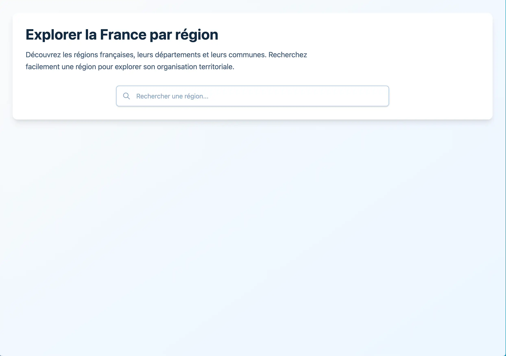

# 🗺️ Explorer la France par région

|  |  |
|:-----------------------------------------------:|:---------------------------------------------------:|
| **Page d'accueil** | **Recherche de région** |

|  |  |
|:------------------------------------------------------------:|:----------------------------------------------------:|
| **Liste des départements** | **Liste des communes** |

Application web moderne permettant d'explorer les régions françaises, leurs départements et leurs communes. Développée avec Angular, cette application offre une interface intuitive pour rechercher et naviguer dans l'organisation territoriale de la France.

## 📋 Table des matières

- [Fonctionnalités](#-fonctionnalités)
- [Stack technique](#-stack-technique)
- [Prérequis](#-prérequis)
- [Installation](#-installation)
- [Développement](#-développement)
- [Tests](#tests)
- [Build de production](#-build-de-production)
- [Structure du projet](#-structure-du-projet)
- [API utilisée](#-api-utilisée)
- [Architecture](#-architecture)

## ✨ Fonctionnalités

- 🔍 **Recherche de régions** : Recherche en temps réel avec autocomplétion
- 📊 **Navigation hiérarchique** : Parcours Région → Département → Communes
- 📋 **Liste des départements** : Affichage des départements d'une région sélectionnée
- 🏘️ **Liste des communes** : Consultation des communes avec pagination et tri
- 🔎 **Recherche de communes** : Filtrage par nom, code postal ou département
- 📱 **Design responsive** : Interface adaptée aux mobiles, tablettes et desktop
- ⚡ **Performance optimisée** : Debounce sur les recherches, pagination efficace

## 🛠️ Stack technique

### Framework et outils principaux

- **Angular 20.0** : Framework frontend moderne avec signals et standalone components
- **TypeScript 5.8** : Typage statique pour une meilleure maintenabilité
- **Vite 7.2** : Build tool rapide et moderne (remplace Webpack)
- **RxJS 7.8** : Programmation réactive pour la gestion des flux de données

### Styling

- **Tailwind CSS 4.1** : Framework CSS utility-first pour un design moderne et responsive
- **PostCSS 8.5** : Traitement CSS avancé

### Tests

- **Vitest 4.0** : Framework de tests moderne et rapide
  - ⚠️ **Note** : Vitest est utilisé à la place de Karma qui est déprécié par Angular
  - **@analogjs/vitest-angular** : Plugin pour intégrer Vitest avec Angular
  - **@testing-library/angular** : Bibliothèque de tests orientée utilisateur
  - **jsdom** : Environnement DOM pour les tests

### Gestion de dépendances

- **pnpm** : Gestionnaire de paquets rapide et efficace (workspace monorepo)

## 📦 Prérequis

Avant de commencer, assurez-vous d'avoir installé :

- **Node.js** (version 18 ou supérieure)
- **pnpm** (version 8 ou supérieure)

Pour installer pnpm si ce n'est pas déjà fait :

```bash
npm install -g pnpm
```

## 🚀 Installation

1.**Cloner le repository** (si applicable) :

```bash
git clone git@github.com:rockethelll/test-key-consulting.git
cd test-key-consulting
```

2.**Installer les dépendances** :

```bash
pnpm install
```

## 💻 Développement

### Démarrer le serveur de développement

```bash
pnpm start
# ou
ng serve
```

L'application sera accessible sur `http://localhost:4200/`. Le serveur rechargera automatiquement l'application lors de la modification des fichiers source.

### Build en mode développement

```bash
pnpm watch
# ou
ng build --watch --configuration development
```

## 🧪 Tests

### Exécuter les tests

```bash
pnpm test
# ou
ng test
```

### Configuration des tests

Cette application utilise **Vitest** au lieu de Karma pour les tests unitaires. Karma étant déprécié par Angular, Vitest offre :

- ⚡ **Performance supérieure** : Exécution des tests plus rapide
- 🔧 **Configuration moderne** : Intégration avec Vite
- 📊 **Interface utilisateur** : Vitest UI pour visualiser les résultats
- 🎯 **Meilleure intégration** : Compatible avec les outils modernes

Les tests sont configurés dans :

- `vite.config.ts` : Configuration Vitest
- `angular.json` : Builder `@analogjs/vitest-angular:test`
- `src/test.setup.ts` : Configuration globale des tests

### Structure des tests

Les fichiers de tests suivent la convention `*.spec.ts` et utilisent :

- **Testing Library** : Pour des tests orientés utilisateur
- **Vitest globals** : Fonctions de test disponibles globalement
- **jsdom** : Environnement DOM simulé

## 🏗️ Build de production

### Build optimisé

```bash
pnpm build
# ou
ng build
```

Le build de production :

- Optimise le code pour la performance
- Minifie les fichiers
- Génère des source maps
- Stocke les artefacts dans le dossier `dist/`

## 📁 Structure du projet

```text
test-key-consulting/
├── src/
│   ├── app/
│   │   ├── core/                    # Code métier centralisé
│   │   │   ├── constants/           # Constantes de l'application
│   │   │   ├── models/              # Modèles de données (Region, Department, Municipality)
│   │   │   └── services/            # Services d'état et logique métier
│   │   ├── GeoApiService/           # Services d'appel API
│   │   │   ├── departmentService/
│   │   │   ├── municipalitiesService/
│   │   │   └── regionService/
│   │   ├── municipalities-list/     # Composant liste des communes
│   │   ├── region-search/           # Composant recherche de régions
│   │   ├── shared/                  # Code partagé
│   │   │   ├── services/            # Services partagés (pagination)
│   │   │   └── types/               # Types TypeScript partagés
│   │   ├── app.config.ts            # Configuration Angular
│   │   ├── app.routes.ts            # Routes de l'application
│   │   └── app.html                 # Template principal
│   ├── environments/                # Configuration par environnement
│   ├── styles.css                   # Styles globaux
│   ├── main.ts                      # Point d'entrée
│   └── test.setup.ts                # Configuration des tests
├── public/                          # Assets statiques
├── angular.json                     # Configuration Angular CLI
├── vite.config.ts                   # Configuration Vite/Vitest
├── tsconfig.json                    # Configuration TypeScript
└── package.json                     # Dépendances et scripts
```

## 🌐 API utilisée

L'application utilise l'**API Géo** du gouvernement français : [geo.api.gouv.fr](https://geo.api.gouv.fr)

### Endpoints utilisés

- **Régions** : `GET https://geo.api.gouv.fr/regions?nom={nom}`
- **Départements** : `GET https://geo.api.gouv.fr/regions/{codeRegion}/departements`
- **Communes** : `GET https://geo.api.gouv.fr/departements/{codeDepartement}/communes`

### Configuration

Les URLs de l'API sont configurées dans :

- `src/environments/environment.ts` (production)
- `src/environments/environment.development.ts` (développement)

## 🏛️ Architecture

### Pattern architectural

L'application suit une architecture modulaire avec :

1. **Services d'état** : Gestion centralisée de l'état avec Angular Signals

   - `RegionSearchStateService` : État de la recherche de régions
   - `MunicipalitiesListStateService` : État de la liste des communes

2. **Services de navigation** : Gestion de la navigation entre les vues

   - `RegionNavigationService` : Navigation entre régions et départements

3. **Services API** : Abstraction des appels HTTP

   - `SearchRegion` : Recherche de régions
   - `SearchDepartment` : Recherche de départements
   - `SearchMunicipalites` : Recherche de communes

4. **Composants** : Présentation et interaction utilisateur
   - Standalone components avec signals
   - Gestion réactive avec RxJS

### Gestion d'état

- **Signals Angular** : Pour l'état réactif
- **Computed signals** : Pour les valeurs dérivées
- **Services injectables** : Pour la logique métier

### Fonctionnalités clés

- **Debounce** : Recherche avec délai de 300ms pour optimiser les appels API
- **Pagination** : Affichage de 15 éléments par page
- **Tri** : Tri multi-colonnes (nom, codes postaux, population)
- **Filtrage** : Recherche dans les communes par nom, code postal ou département

## 📝 Scripts disponibles

| Script  | Commande           | Description                             |
| ------- | ------------------ | --------------------------------------- |
| `start` | `ng serve`         | Démarre le serveur de développement     |
| `build` | `ng build`         | Build de production                     |
| `watch` | `ng build --watch` | Build en mode watch                     |
| `test`  | `ng test`          | Exécute les tests unitaires avec Vitest |

## 🤝 Contribution

Ce projet est un projet de démonstration. Pour contribuer :

1. Fork le projet
2. Créez une branche pour votre fonctionnalité (`git checkout -b feature/AmazingFeature`)
3. Committez vos changements (`git commit -m 'Add some AmazingFeature'`)
4. Push vers la branche (`git push origin feature/AmazingFeature`)
5. Ouvrez une Pull Request

## 📄 Licence

Ce projet est sous licence - voir le fichier [LICENSE](LICENSE) pour plus de détails.

## 🔗 Ressources

- [Documentation Angular](https://angular.dev)
- [Documentation Vitest](https://vitest.dev)
- [Documentation Tailwind CSS](https://tailwindcss.com)
- [API Géo - Documentation](https://geo.api.gouv.fr)
- [Angular CLI Overview](https://angular.dev/tools/cli)

---
